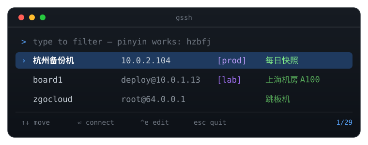

<div align="center">



<h1>gssh</h1>

**A searchable picker over your ssh hosts — that still leaves `ssh` in charge.**

[](https://github.com/clveryang/gssh/releases)
[](https://github.com/clveryang/gssh/actions/workflows/ci.yml)
[](LICENSE)
[](go.mod)
[](https://github.com/clveryang/gssh/releases)
[](https://github.com/clveryang/gssh/stargazers)

English | [中文](README.zh-CN.md)

</div>

***

## Why this exists

`ssh` already stores many hosts, and already tab-completes them. Storing was
never the problem.

The problem shows up at thirty hosts named `13`, `62`, `board3` and `杭州备份机`:
**you cannot find the one you want, and you cannot type the ones in Chinese.**

gssh adds exactly two things on top of stock ssh, and changes nothing else:

|   | |
|---|---|
| **Metadata** | Groups, tags and notes — things `ssh_config` has nowhere to put. |
| **Search that works on Chinese names** | `hzbfj` finds `杭州备份机`, `gzsc2` finds `广州生产2`, `bjgpu` finds `北京GPU`. No other ssh manager does this, and it is the reason this one exists. |

gssh never speaks the SSH protocol itself. It renders an `ssh_config` fragment
and `exec`s the real `ssh`, so agent forwarding, `ControlMaster`, jump hosts and
signal handling behave exactly as they always did.

***

## Install

```sh
curl -fsSL https://raw.githubusercontent.com/clveryang/gssh/main/install.sh | sh
```

One line, no Go toolchain — works on your laptop and on the servers you ssh
into. Installs to `~/.local/bin`, no sudo. Downloads are checksum-verified
against the release's `checksums.txt`, which is always fetched from GitHub even
if you point the download at a mirror.

<details>
<summary>Other ways, and the knobs</summary>

```sh
go install github.com/clveryang/gssh@latest             # if you have Go
git clone https://github.com/clveryang/gssh && cd gssh && make install
```

| Variable | Effect |
|---|---|
| `GSSH_INSTALL_DIR` | Where to install (default `~/.local/bin`) |
| `GSSH_VERSION` | Pin a version, e.g. `v0.3.0` |
| `GSSH_BASE_URL` | Mirror for the download only — checksums still come from GitHub |
| `GSSH_SKIP_CHECKSUM=1` | Explicit opt-out of verification |

Prebuilt for darwin and linux on amd64 and arm64. Or take a binary from the
[releases page](https://github.com/clveryang/gssh/releases).
</details>

***

## Getting started

Just run it:

```sh
gssh
```

With nothing configured yet, it notices the hosts already in your `~/.ssh/config`
and offers to take them over. Say yes and you are done — it backs up your
`ssh_config`, writes the YAML and syncs, in one step.

Starting from scratch instead? `gssh write` opens a commented template.

```sh
gssh                     # first run: offers to import; after that, the picker
gssh write               # edit the YAML (validated and applied on save)
gssh list                # see everything you have
gssh doctor              # duplicates, typos, missing keys, unmemorable names
```

<details>
<summary>Doing the import explicitly</summary>

```sh
gssh import              # shows what it found, asks, then writes and syncs
gssh import --dry-run    # print the resulting YAML and stop
gssh import --yes        # no prompt, for scripts
```

It does not follow `Include` directives (those files belong to other tools) and
your `ssh_config` keeps all of its original content — gssh only adds one
`Include` line.
</details>

***

## How it fits together

```
~/.config/gssh/hosts.yaml        you edit this
        │  gssh sync
        ▼
~/.ssh/config.d/gssh.conf        generated, never hand-edited
        │  Include
        ▼
~/.ssh/config                    one Include line added, nothing else touched
```

Because the result is a plain `ssh_config`, every other tool picks it up for
free — `scp`, `rsync`, `git`, and VS Code Remote-SSH included.

***

## Usage

```sh
gssh                     # interactive picker
gssh shanghai            # connect
gssh shanghai uptime     # run a command
gssh shanghai -- -L 8080:localhost:8080   # flags after -- go straight to ssh

gssh list                # list everything (gssh ls also works)
gssh list -t prod        # filtered by tag
gssh add                 # add a host interactively
gssh write               # open in $EDITOR; validated and synced on save
gssh doctor              # find problems in the host file
gssh completion zsh      # completion script, with notes shown inline
```

### Tab completion

```sh
echo 'source <(gssh completion zsh)' >> ~/.zshrc && exec zsh
```

Then `gssh v<TAB>` becomes `gssh vast.ai.5060`, and it understands the same
things the picker does: `gssh myjx<TAB>` → `gssh 美亚镜像`, and an IP fragment
completes to the host that owns it. (zsh normally discards candidates that do
not start with what you typed, which would throw away exactly those matches;
gssh's script takes over that decision for the host argument.)

### The picker

`gssh` with no arguments opens it. Type to filter — pinyin included — and the
list is ordered most-recently-used first, because on thirty hosts you really
use five. That ordering is the one thing shell completion cannot give you.

```
> bo
› board1  deploy@10.0.1.13  [lab]  shanghai rack A100
  board2  deploy@10.0.1.14  [lab]
  1/2  ↑↓ move  ⏎ connect  ^e edit  esc quit
```

***

## Config

```yaml
defaults:
  identity_file: ~/.ssh/id_rsa
  server_alive_interval: 30

groups:
  - name: 板卡
    tags: [lab]
    hosts:
      - name: board1
        alias: [b1]
        host: 10.0.1.13
        user: deploy
        note: shanghai rack A100
      - name: 杭州备份机
        host: 10.0.2.104
        raw:                       # any ssh_config keyword gssh has no field for
          Compression: "yes"
```

The host file lives at `~/.config/gssh/hosts.yaml` (`$XDG_CONFIG_HOME` is
honoured; `GSSH_CONFIG` overrides both). `gssh doctor` prints the path it used.

Tags on a group are inherited by its hosts. `defaults` fills in fields a host
leaves unset; port-forward lists are concatenated rather than replaced.

`gssh add` and `gssh edit` preserve the comments and indentation you wrote.
(Blank lines are not preserved — a `yaml.v3` limitation.)

***

## On not breaking your ssh_config

Your `~/.ssh/config` is the only record of how you reach your machines, so:

- `import` is preview-only until `--write`, and backs the file up before touching it
- `edit` works on a temporary copy and writes back **only once the YAML parses**, so a syntax error can never leave you with a broken host file
- `add` inserts into the document node tree rather than re-marshalling, so your comments survive
- the generated fragment is a separate file; your `ssh_config` gains one `Include` line and keeps everything else, in order

Verified against a real 29-host config: `ssh -G` — ssh's own config evaluator —
reports all 29 hosts **semantically identical** before and after the migration.

***

## Status

| Milestone | |
|---|---|
| Config model, `import` / `sync` / `ls` / `doctor`, pinyin completion | ✅ |
| Interactive picker with pinyin search and MRU ordering | ✅ |
| `add` / `edit`, both comment-preserving | ✅ |
| One-line installer, four-platform automated releases | ✅ |

## License

[MIT](LICENSE)
